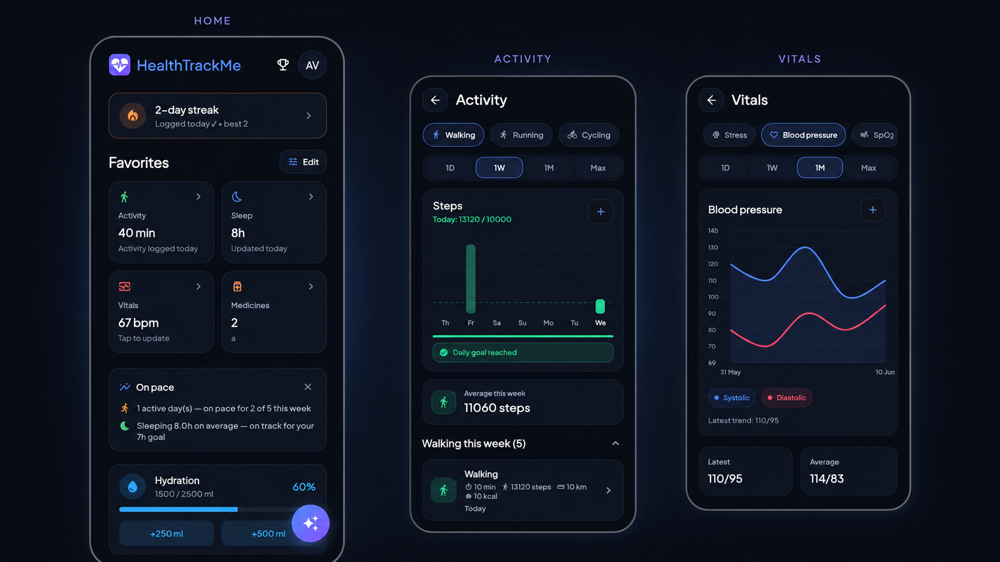
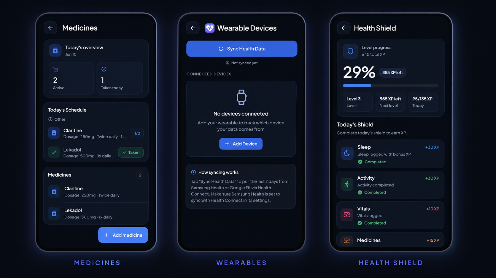

<div align="center">

# HealthTrackMe

A personal health tracking platform with a Flutter mobile app, a Kotlin/Spring Boot API, PostgreSQL data storage, wearable sync, reminders, reports, and AI-assisted health insights.


</div>


## Overview

HealthTrackMe is a student project for tracking day-to-day health data in one place. The app lets a user register or sign in, log health entries, manage medicines and reminders, sync steps/sleep/activity data from device health providers, view reports, compare progress with friends, and export personal data.

The repository is split into two main applications:

- [Backend API](apps/api/README.md): Kotlin + Spring Boot REST API with PostgreSQL, Flyway, JWT auth, Google Sign-In verification, CSV export, email summaries, Health Shield scoring, and AI Detective endpoints.
- [Flutter mobile app](apps/mobile_flutter/README.md): Flutter app with dashboard, diary/logging, health tabs, medicines, reports, profile, wearables, friends, localization, notifications, and background/foreground sync.

## Main Features

- Email/password login and Google Sign-In with JWT-backed API access.
- Health dashboard with daily summary, recent metrics, medicines, progress, and quick navigation.
- Diary/log screen for mood, symptoms, vitals, sleep, water, notes, and activity-related entries.
- Health area with vitals, activity, sleep, history, charts, and manual entries.
- Medicines module with schedules, reminder times, adherence tracking, and local notifications.
- Wearable/device sync through Health Connect and related phone sensors where supported.
- Health Shield scoring, streaks, XP-style progress, and consistency feedback.
- Friends and leaderboard features for social comparison.
- Profile, preferences, language switching, profile photo, medical history, and export flows.
- CSV/data export and optional email summary delivery.
- AI Health Detective backed by Groq when configured, with rule-based fallback behavior.

## Tech Stack

| Layer    | Technology                                                                                     |
| -------- | ---------------------------------------------------------------------------------------------- |
| Mobile   | Flutter, Dart, go_router, Provider, fl_chart, Health Connect, Workmanager, local notifications |
| Backend  | Kotlin, Spring Boot 3.5, Maven, Spring Data JPA, validation, mail, JWT                         |
| Database | PostgreSQL 16, Flyway migrations, Hibernate/JPA                                                |
| Auth     | Email/password JWT, Google Sign-In token verification                                          |
| AI       | Groq API for Health Detective insights and Q&A, rule-based fallback                            |
| Deploy   | Railway for API, Firebase App Distribution for Android APK, GitHub Actions CI                  |

## Repository Layout

```text
.
├── apps/
│   ├── api/                 Kotlin/Spring Boot backend
│   └── mobile_flutter/      Flutter frontend
├── docs/
│   ├── database/ER-diagram.png
│   ├── project-overview/
│   │   ├── HealthTrackMe_Projektna_Dokumentacija.docx
│   │   └── healthtrackme_ui_mockup.html
│   └── setup-and-sync/
│       ├── local-google-auth.md
│       └── sync-and-autodetect.md
├── scripts/
│   ├── run-api-local.ps1
│   └── run-flutter-local.ps1
├── docker-compose.yml       Local PostgreSQL
├── .env.example             Local environment template
└── README.md                Project overview
```

## Quick Start

### 1. Configure local environment

```powershell
Copy-Item .env.example .env
```

At minimum, set Google OAuth values if you want Google Sign-In locally:

```env
GOOGLE_OAUTH_ALLOWED_CLIENT_IDS=your-web-client-id.apps.googleusercontent.com
GOOGLE_WEB_CLIENT_ID=your-web-client-id.apps.googleusercontent.com
```

`GOOGLE_WEB_CLIENT_ID` is the Web OAuth Client ID that Flutter uses as its `serverClientId`. The backend variable `GOOGLE_OAUTH_ALLOWED_CLIENT_IDS` must include that same Web OAuth Client ID so the API can verify Google Sign-In tokens.

### 2. Start PostgreSQL

```powershell
docker compose up -d
```

This starts PostgreSQL on `localhost:5432` with the default database name `healthtrackme`.

### 3. Start the backend

```powershell
./scripts/run-api-local.ps1
```

Or directly:

```powershell
cd apps/api
./mvnw.cmd spring-boot:run
```

The local API runs on `http://localhost:8080` and exposes versioned endpoints under `/api/v1`.

### 4. Start the Flutter app

```powershell
./scripts/run-flutter-local.ps1
```

Or directly:

```powershell
cd apps/mobile_flutter
flutter pub get
flutter run
```

For web development, the default API URL is `http://localhost:8080/api/v1`. For Android builds, the app currently defaults to the deployed Railway API.

## Deploy

### Backend API

The backend is intended to run on Railway. Production configuration is supplied through Railway variables:

- `DATABASE_URL`, `DATABASE_USERNAME`, `DATABASE_PASSWORD`
- `JWT_SECRET`, `JWT_EXPIRATION_SECONDS`, `AUTH_ENABLED`
- `GOOGLE_OAUTH_ALLOWED_CLIENT_IDS`
- optional `GROQ_API_KEY`, `GROQ_MODEL`
- optional `APP_MAIL_ENABLED`, `APP_MAIL_FROM`, `BREVO_API_KEY`, `RESEND_API_KEY`, or SMTP credentials

The backend Dockerfile is in [apps/api/Dockerfile](apps/api/Dockerfile). See [apps/api/README.md](apps/api/README.md) for backend details.

### Android App

Android release builds are distributed with Firebase App Distribution through `.github/workflows/android-distribute.yml`. The workflow builds a signed release APK from the `develop` branch or manual dispatch.

Android signing is handled through GitHub Actions secrets.

Required GitHub secrets include:

- `KEYSTORE_BASE64`
- `KEYSTORE_PASSWORD`
- `KEY_ALIAS`
- `KEY_PASSWORD`
- `GOOGLE_WEB_CLIENT_ID`
- `FIREBASE_SERVICE_ACCOUNT`

See [apps/mobile_flutter/README.md](apps/mobile_flutter/README.md) for Flutter setup and release notes.

## CI and Verification

Backend CI runs Maven tests and a Docker build:

```powershell
cd apps/api
./mvnw.cmd clean test
```

Frontend CI runs format, analysis, and tests:

```powershell
cd apps/mobile_flutter
dart format --output=none --set-exit-if-changed .
flutter analyze
flutter test
```

## Screenshots

<p align="center">
  
</p>

<p align="center">
  
</p>

---
## Useful Links

- [DELUJOČA REŠITEV APK](https://github.com/matijag13/HealthTrackMe/releases)
- [Backend README](apps/api/README.md)
- [Flutter README](apps/mobile_flutter/README.md)
- [ER diagram](docs/database/ER-diagram.png)
- [Local Google auth notes](docs/setup-and-sync/local-google-auth.md)
- [Sync and auto-detect notes](docs/setup-and-sync/sync-and-autodetect.md)
- [Project overview document](docs/project-overview/HealthTrackMe_Projektna_Dokumentacija.docx)
- [UI mockup](docs/project-overview/healthtrackme_ui_mockup.html)
- [Environment template](.env.example)

## Authors

- GUSEL MATIJA
- VOLLMEIER ANEJ
