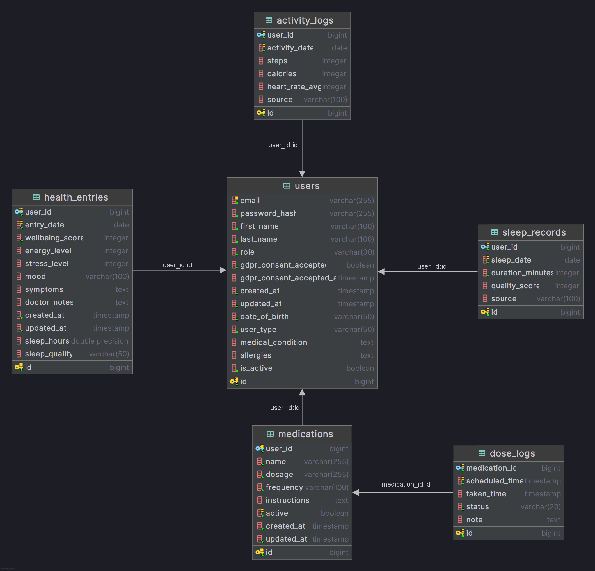

# HealthTrackMe Backend API

A comprehensive Spring Boot + Kotlin backend for health tracking application with features for symptom tracking, medicine management, wearable device integration, and health analytics.

## Project Structure

```
src/main/kotlin/com/healthwithme/api/
├── model/              # JPA Entity models
│   ├── User.kt
│   ├── HealthEntry.kt
│   ├── Medicine.kt
│   ├── WearableDevice.kt
│   ├── SportActivity.kt
│   ├── HealthAlert.kt
│   ├── HealthShieldStatus.kt
│   └── HealthShieldDailyPoints.kt
├── dto/                # Data Transfer Objects
│   ├── UserDto.kt
│   ├── HealthEntryDto.kt
│   ├── MedicineDto.kt
│   ├── WearableDeviceDto.kt
│   ├── AlertAndActivityDto.kt
│   └── HealthShieldDto.kt
├── repository/         # JPA Repositories for data access
│   ├── UserRepository.kt
│   ├── HealthEntryRepository.kt
│   ├── MedicineRepository.kt
│   ├── WearableDeviceRepository.kt
│   ├── HealthAlertRepository.kt
│   ├── SportActivityRepository.kt
│   ├── HealthShieldStatusRepository.kt
│   └── HealthShieldDailyPointsRepository.kt
├── service/            # Business logic layer
│   ├── UserService.kt
│   ├── HealthEntryService.kt
│   ├── MedicineService.kt
│   ├── WearableDeviceService.kt
│   ├── HealthAlertService.kt
│   ├── SportActivityService.kt
│   ├── HealthAnalysisService.kt
│   └── HealthShieldService.kt
├── controller/         # REST API endpoints
│   ├── UserController.kt
│   ├── HealthEntryController.kt
│   ├── MedicineController.kt
│   ├── WearableDeviceController.kt
│   ├── HealthAlertController.kt
│   ├── SportActivityController.kt
│   ├── ExportController.kt
│   └── HealthShieldController.kt
├── config/             # Spring configuration
│   └── SecurityConfig.kt
├── exception/          # Exception handling
│   └── GlobalExceptionHandler.kt
└── util/               # Utility functions
    └── ExportUtil.kt

src/main/resources/
├── application.yaml    # Database and app configuration
└── db/migration/       # Flyway database migrations
```

## Adding Outside Files to the Project

### 1. **Adding External Libraries/Dependencies**

To add external libraries, edit `pom.xml`:

```xml
<dependencies>
    <!-- Add your dependency here -->
    <dependency>
        <groupId>group</groupId>
        <artifactId>artifact</artifactId>
        <version>version</version>
    </dependency>
</dependencies>
```

Then run: `./mvnw clean compile` (on Windows: `.\mvnw.cmd clean compile`)

### 2. **Adding Configuration Files**

Create new configuration files in `src/main/resources/`:

```
src/main/resources/
├── application.yaml           # Main config (existing)
├── application-dev.yaml       # Development config
├── application-prod.yaml      # Production config
├── messages.properties         # i18n messages
├── security.properties        # Security settings
└── logging.xml                # Logging configuration
```

Load profile-specific config with: `spring.profiles.active=dev` in application.yaml

### 3. **Adding Custom Annotations**

Create in `src/main/kotlin/com/healthwithme/api/annotations/`:

```kotlin
package com.healthwithme.api.annotation

@Target(AnnotationTarget.CLASS, AnnotationTarget.FUNCTION)
@Retention(AnnotationRetention.RUNTIME)
annotation class RequireAuth(val roles: Array<String> = [])
```

### 4. **Adding Utility/Helper Classes**

Create in `src/main/kotlin/com/healthwithme/api/util/` or `helper/`:

```kotlin
package com.healthwithme.api.util

object DateTimeUtil {
    fun getCurrentDateTime(): String = LocalDateTime.now().toString()
}
```

### 5. **Adding Request/Response Interceptors**

Create in `src/main/kotlin/com/healthwithme/api/middleware/`:

```kotlin
package com.healthwithme.api.middleware

@Component
class AuthInterceptor : HandlerInterceptor {
    override fun preHandle(...): Boolean { ... }
}
```

### 6. **Adding Event Listeners**

Create in `src/main/kotlin/com/healthwithme/api/event/`:

```kotlin
package com.healthwithme.api.event

@Component
class HealthEntryEventListener {
    @EventListener
    fun onHealthEntryCreated(event: HealthEntryCreatedEvent) { ... }
}
```

### 7. **Adding Custom Validators**

Create in `src/main/kotlin/com/healthwithme/api/validator/`:

```kotlin
package com.healthwithme.api.validator

@Component
class EmailValidator {
    fun isValid(email: String): Boolean = email.contains("@")
}
```

### 8. **Adding Database Migrations (Flyway)**

Create SQL files in `src/main/resources/db/migration/`:

```
V1__init_database.sql
V2__add_health_entries.sql
V3__add_medicines.sql
```

Example structure:

```sql
-- V1__init_database.sql
CREATE TABLE users (
    id SERIAL PRIMARY KEY,
    email VARCHAR(255) UNIQUE NOT NULL,
    password VARCHAR(255) NOT NULL,
    first_name VARCHAR(100),
    last_name VARCHAR(100),
    created_at TIMESTAMP DEFAULT CURRENT_TIMESTAMP
);
```

### 9. **Adding Scheduled Tasks**

Create in `src/main/kotlin/com/healthwithme/api/scheduler/`:

```kotlin
package com.healthwithme.api.scheduler

@Component
class HealthCheckScheduler(private val alertService: HealthAlertService) {
    @Scheduled(fixedRate = 86400000) // Every 24 hours
    fun generateDailyAlerts() { ... }
}
```

### 10. **Adding Tests**

Create in `src/test/kotlin/com/healthwithme/api/`:

```kotlin
package com.healthwithme.api.service

@SpringBootTest
class UserServiceTest {
    @Test
    fun testCreateUser() { ... }
}
```

## Current Features Implemented

### 1. **User Management**

- User registration and profile management
- User types: PATIENT, ATHLETE, ELDERLY, HEALTHCARE_WORKER
- Medical conditions and allergies tracking

### 2. **Health Journal**

- Record daily health entries with symptoms
- Track mood, energy level, sleep, stress
- Add personal notes

### 3. **Medicine Management**

- Manage medicines, vitamins, supplements, and other tracked health items.
- Items are distinguished by item_type.
- Track active medications and record side effects.

### 4. **Wearable Device Integration**

- Register and manage wearable devices
- Device types: SMARTWATCH, FITNESS_TRACKER, HEART_MONITOR, etc.
- Sync device data

### 5. **Sport Activities**

- Log workout activities with details
- Track duration, distance, calories, heart rate
- Activity statistics

### 6. **Health Alerts**

- Automatic alerts for unusual trends
- Alert severity levels: LOW, MEDIUM, HIGH, CRITICAL
- Mark alerts as read

### 7. **Data Export**

- Export health entries to CSV
- Export sport activities to CSV
- Generate comprehensive health summary

### 8. **Health Analysis**

- Analyze stress trends
- Monitor sleep quality
- Track energy levels
- Detect symptom patterns

### 9. **Health Shield**

Health Shield provides a backend endpoint for returning the user's current health consistency status, including shield level, total consistency points, daily points breakdown, progress to the next level, and inactivity penalty information.

## Running the Application

### Prerequisites

- Java 25+
- PostgreSQL 13+
- Maven Wrapper

### Setup

1. **Clone the repository**

```bash
git clone <repository-url>
cd apps/api
```

2. **Configure database** in `application.yaml`:

```yaml
spring:
  datasource:
    url: ${DATABASE_URL:jdbc:postgresql://localhost:5432/healthtrackme}
    username: ${DATABASE_USERNAME:healthtrackme}
    password: ${DATABASE_PASSWORD:healthtrackme}
```

Actual values are stored locally in a `.env` file, and in production as environment variables in GitHub Secrets or the hosting environment. For local development, these defaults work with the provided Docker Compose PostgreSQL setup.

3. **Run the application**

Linux/macOS:

```bash
./mvnw clean test
./mvnw spring-boot:run
```

Windows:

```cmd
.\mvnw.cmd clean test
.\mvnw.cmd spring-boot:run
```

The API will be available at `http://localhost:8080`

### Seeded demo accounts

On startup, Flyway inserts one admin account and a few demo users so the backend is not empty after a fresh database setup.

| Role | Email | Password |
| --- | --- | --- |
| Admin | `admin@healthtrackme.local` | `Admin@12345` |
| User | `ana.novak@example.com` | `Demo@12345` |
| User | `luka.horvat@example.com` | `Demo@12345` |
| User | `maja.kovac@example.com` | `Demo@12345` |
| User | `nina.zupan@example.com` | `Demo@12345` |

## Database

The backend uses PostgreSQL, Spring Data JPA/Hibernate, and Flyway migrations. The `users` table is the central table, while health entries, medicines, sleep, and sport activities are connected to the user via foreign key relationships.

- `health_shield_status` stores the current Health Shield state for each user.
- `health_shield_daily_points` stores the daily point calculation breakdown.
- `medications` now includes `item_type` for MEDICATION, VITAMIN, SUPPLEMENT, and OTHER.

<div align="center">
  
</div>

## Testing

The project includes test coverage for various services and controllers, including the newly added `HealthShieldServiceTest` and `HealthShieldControllerTest`. Currently, there are 11 tests covering the Health Shield backend logic and controller.

You can run the tests using Maven:

Linux/macOS:

```bash
./mvnw test
./mvnw clean install
```

Windows:

```cmd
.\mvnw.cmd test
.\mvnw.cmd clean install
```

## CI/CD

The backend uses a GitHub Actions workflow:
`.github/workflows/backend-ci.yml`

The CI pipeline runs the Maven test suite, which includes the Health Shield service and controller tests.

The pipeline checks:

- Maven build
- Tests
- Docker image build
- PostgreSQL service in the CI environment

## API Endpoints

### Users

- `POST /api/v1/users` - Create user
- `GET /api/v1/users/{id}` - Get user
- `PUT /api/v1/users/{id}` - Update user
- `DELETE /api/v1/users/{id}` - Deactivate user

### Health Entries

- `POST /api/v1/health-entries/users/{userId}` - Create entry
- `GET /api/v1/health-entries/{id}` - Get entry
- `GET /api/v1/health-entries/users/{userId}` - Get user's entries

### Medicines

- `POST /api/v1/medicines/users/{userId}` - Add medicine
- `GET /api/v1/medicines/{id}` - Get medicine
- `GET /api/v1/medicines/users/{userId}` - Get user's medicines

### Wearable Devices

- `POST /api/v1/wearable-devices/users/{userId}` - Register device
- `GET /api/v1/wearable-devices/{id}` - Get device
- `POST /api/v1/wearable-devices/{id}/sync` - Sync device

### Sport Activities

- `POST /api/v1/sport-activities/users/{userId}` - Create activity
- `GET /api/v1/sport-activities/{id}` - Get activity
- `GET /api/v1/sport-activities/users/{userId}/stats` - Get statistics

### Alerts

- `GET /api/v1/health-alerts/users/{userId}` - Get user alerts
- `GET /api/v1/health-alerts/users/{userId}/unread` - Get unread alerts
- `PUT /api/v1/health-alerts/{id}/read` - Mark alert as read

### Export

- `GET /api/v1/export/health-entries/csv/{userId}` - Export health entries
- `GET /api/v1/export/sport-activities/csv/{userId}` - Export activities
- `GET /api/v1/export/summary/{userId}` - Get health summary
- `GET /api/v1/export/all/{userId}` - Export all data

### Health Shield

- `GET /api/v1/health-shield/{userId}` - Get user's current Health Shield status
- `GET /api/health-shield/{userId}` - Legacy route (still supported)
